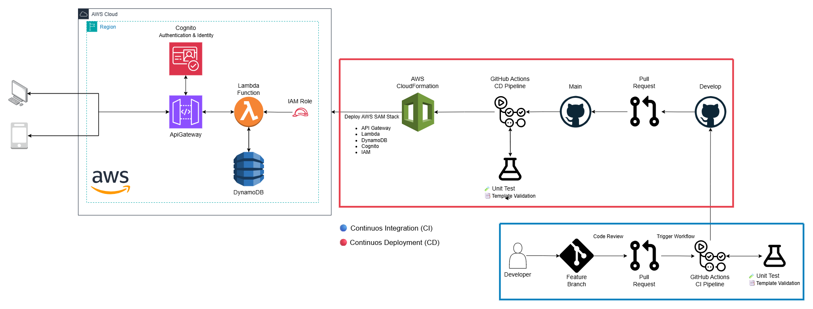

# 📦 AWS Serverless Portfolio
📌 Overview

This project demonstrates a serverless architecture on AWS, showcasing a secure API built with API Gateway, Lambda, DynamoDB, Cognito, and IAM.
It was designed as part of my professional portfolio to highlight best practices in serverless development, infrastructure as code (IaC) using AWS SAM and AWS CloudFormation, and CI/CD automation.

---

## 🚀 Architecture

- Amazon API Gateway (REST) – Entry point for client requests.
  
- Amazon Cognito – User authentication and identity management.

- AWS IAM Roles & Policies – Fine-grained authorization for Lambda and AWS resources.

- AWS Lambda – Stateless business logic.

- Amazon DynamoDB – NoSQL storage.

- AWS SAM (IaC) – Infrastructure definition using simplified syntax.

- AWS CloudFormation – Orchestrates and provisions AWS resources from SAM templates.

---

## 📊 Diagram:



---

## 🛠️ Tech Stack

- Languages: Node.js (JavaScript)

- AWS Services: Lambda, API Gateway, Cognito, IAM, DynamoDB

- Infrastructure: AWS SAM (CloudFormation)

- CI/CD: GitHub Actions

---

## 📂 Infrastructure Stacks
- [IAM Stack](aws-backend/infrastructure/iam/README.md) – Lambda role & DynamoDB policy
- [DynamoDB Stack](aws-backend/infrastructure/database/README.md) – NoSQL table
- [Cognito Stack](aws-backend/infrastructure/cognito/README.md) – Authentication & identity
- [API Gateway Stack](aws-backend/infrastructure/api-gateway-lambdas/README.md) – REST endpoints

---

## ⚡ Features

✅ Secure authentication and authorization with Cognito + IAM.

✅ CRUD operations exposed via API Gateway + Lambda.

✅ Data persistence with DynamoDB.

✅ Infrastructure as Code with AWS SAM.

✅ Automated deployment using GitHub Actions.

---

## 📂 Project Structure
```bash
aws-serverless-portfolio/
│── src/                # Lambda functions
│── infrastructure/     # SAM templates (API Gateway, DynamoDB, Cognito, IAM)
│── docs/               # Architecture diagrams, documentation
│── tests/              # Unit tests
│── .github/workflows/  # CI/CD pipelines
│── README.md           # Project documentation
```
---

## 🧑‍💻 Getting Started
Prerequisites

- AWS CLI configured with credentials

- AWS SAM CLI installed

- Node.js >= 18

---

## 🧪 Testing
- npm install
- npm test

---

## 📈 CI/CD

This project includes a GitHub Actions workflow that:

- Runs linting and unit tests.

- Builds and packages the SAM template.

- Deploys to AWS.

---

## 📄 Example workflow:
```bash
name: Deploy to AWS
on:
  push:
    branches: [ "main" ]
jobs:
  deploy:
    runs-on: ubuntu-latest
    steps:
      - uses: actions/checkout@v3
      - uses: aws-actions/setup-sam@v2
      - run: sam build
      - run: sam deploy --no-confirm-changeset --stack-name serverless-portfolio
```
---

## 👨‍💻 Author

Manuel Cumplido

- 🚀 Cloud Developer | AWS Serverless Specialist

- 🎓 AWS Certified Solutions Architect – Associate | AWS Certified Cloud Practitioner

- 🌐 [LinkedIn](https://www.linkedin.com/in/manuel-cumplido)

- 📧 manuelcumplido.9@gmail.com
