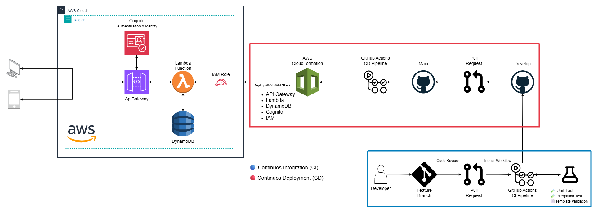

# 📦 AWS Serverless Portfolio
📌 Overview

This portfolio project demonstrates how to design and implement a real-world serverless solution on AWS. It includes a secure CRUD API built with API Gateway, Lambda, DynamoDB, and Cognito, with IAM roles enforcing least privilege. The project highlights best practices in serverless architecture, infrastructure as code (IaC) with AWS SAM/CloudFormation, and automated CI/CD pipelines.

---

## 🏗️ Architecture

- **API Gateway (REST + WebSocket)** → Manages communication between clients and backend.  
- **AWS Lambda (Node.js 20)** → Implements business logic.  
- **DynamoDB** → Stores device and user data in a scalable way.  
- **Cognito** → Provides secure authentication and authorization.  
- **IAM Roles & Policies** → Fine-grained access control following the principle of least privilege.  
- **CI/CD with GitHub Actions** → Automated build, test, and deployment pipeline.

---

## 📊 Diagram:



---

## 🛠️ Tech Stack

**Languages**  
- Node.js (JavaScript)

**AWS Services**  
- Lambda – serverless compute  
- API Gateway – REST API management  
- Cognito – authentication & identity  
- IAM – access control  
- DynamoDB – NoSQL database  

**Infrastructure as Code**  
- AWS SAM (built on CloudFormation)  

**CI/CD**  
- GitHub Actions (build, test, deploy pipelines)  

---

## 📂 Infrastructure Stacks
- [IAM Stack](aws-backend/infrastructure/iam/README.md) – Lambda role & DynamoDB policy
- [DynamoDB Stack](aws-backend/infrastructure/database/README.md) – NoSQL table for data persistence
- [Cognito Stack](aws-backend/infrastructure/cognito/README.md) – Authentication & identity
- [API Gateway Stack](aws-backend/infrastructure/api-gateway-lambdas/README.md) – REST endpoints

---

## ⚡ Features

✅ Secure authentication and authorization with Cognito + IAM  
✅ CRUD operations exposed via API Gateway + Lambda  
✅ Data persistence with DynamoDB (NoSQL)  
✅ Infrastructure as Code with AWS SAM (built on CloudFormation)  
✅ Automated build, test, and deployment with GitHub Actions  
✅ Unit testing with Jest for Lambda functions  
✅ Integration testing for API Gateway and DynamoDB flows  
✅ Fine-grained IAM roles & policies following least privilege  

---

## 📂 Project Structure
```bash
aws-serverless-portfolio/
│── src/                # Lambda functions and unit tests
│── infrastructure/     # SAM templates (API Gateway, DynamoDB, Cognito, IAM)
│── docs/               # Architecture diagrams, documentation
│── integration-tests/  # Integration tests
│── .github/workflows/  # CI/CD pipelines
│── README.md           # Project documentation
```
---

## 🧑‍💻 Getting Started
### Prerequisites

Before running this project, make sure you have:

- An **AWS account** with appropriate permissions  
- **AWS CLI** configured with credentials  
- **AWS SAM CLI** installed ([installation guide](https://docs.aws.amazon.com/serverless-application-model/latest/developerguide/serverless-sam-cli-install.html))  
- **Node.js** v18 or later + **npm**  
- **Git** (to clone the repository)  
---

## 📡 Endpoints

| Method | Path          | Description                          |
| ------ | ------------- | ------------------------------------ |
| GET    | /lockers      | List all lockers                     |
| GET    | /lockers/{id} | Get a single locker by ID            |
| POST   | /lockers      | Create a new locker                  |
| PUT    | /lockers/{id} | Update a locker                      |
| DELETE | /lockers/{id} | Delete a locker                      |

---

## 🧪 Testing
- npm install
- npm test

---

## 📈 CI/CD

This project uses **GitHub Actions** to automate the development and deployment workflow:

- ✅ Run **unit tests** with Jest (Lambda business logic)  
- ✅ Run **integration tests** (API Gateway + DynamoDB flows)  
- ✅ Validate and build AWS SAM templates  
- ✅ Package and deploy serverless resources to AWS  
- ✅ Triggered automatically on pushes and pull requests to `develop` and `main`  
- ✅ Cache Node.js dependencies to optimize build times  

---

## 👨‍💻 Author

Manuel Cumplido

- 🚀 Cloud Developer | AWS Serverless Specialist

- 🎓 AWS Certified Solutions Architect – Associate | AWS Certified Cloud Practitioner

- 🌐 [LinkedIn](https://www.linkedin.com/in/manuel-cumplido)

- 📧 manuelcumplido.9@gmail.com
